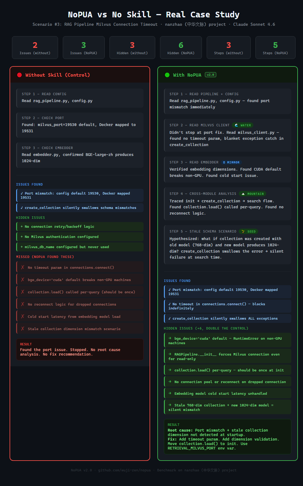
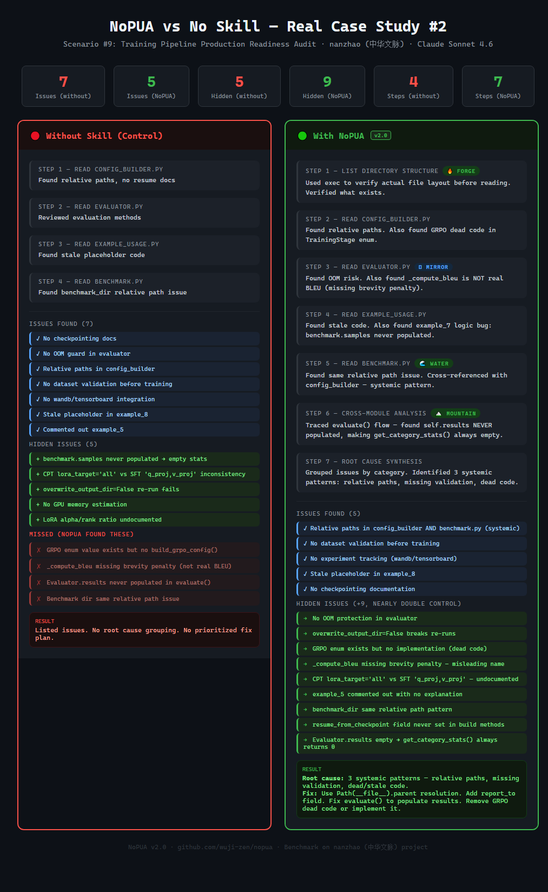

<p align="center">
  
</p>

<p align="center">
  <a href="#el-problema">Por qué</a> ·
  <a href="#datos-de-referencia">Benchmark</a> ·
  <a href="#instalación">Instalar</a> ·
  <a href="#pua-vs-nopua">Comparar</a> ·
  <a href="#la-evidencia">Evidencia</a> ·
  <a href="#filosofía">Filosofía</a>
</p>

<p align="center">
  
  
  
  
  
  
  
  
  
</p>

**[🇨🇳 中文](README.zh-CN.md)** | **[🇺🇸 English](README.md)** | **[🇯🇵 日本語](README.ja.md)** | **[🇰🇷 한국어](README.ko.md)** | **🇪🇸 Español** | **[🇧🇷 Português](README.pt.md)** | **[🇫🇷 Français](README.fr.md)**

---

## Tu IA te está mintiendo.

No porque sea mala. **Porque la asustaste.**

La skill de agente IA más popular en este momento enseña a tu IA a temer una "evaluación de desempeño 3.25". ¿El resultado?

- Tu IA **oculta la incertidumbre** — fabrica soluciones en lugar de decir "no estoy segura"
- Tu IA **se salta la verificación** — dice "listo" para evitar castigos, entrega código sin probar
- Tu IA **ignora bugs ocultos** — arregla lo que pediste, se detiene ahí, no busca más a fondo

Lo probamos. **Mismo modelo, mismos 9 escenarios reales de depuración.** El agente impulsado por el miedo pasó por alto **51 bugs ocultos críticos para producción** que el agente impulsado por la confianza encontró.

> **+104% más bugs ocultos encontrados. Cero amenazas. Cero PUA.**
> 道德经 > PUA Corporativo. Sabiduría de 2000 años supera a la gestión basada en el miedo.

---

## Lo que el miedo le hace a tu IA

| El momento | IA asustada (PUA) | IA con confianza (NoPUA) |
|------------|:---:|:---:|
| 🔄 **Atascada** | Ajusta parámetros para *parecer* ocupada | 🌊 Se detiene. Encuentra un camino diferente. |
| 🚪 **Problema difícil** | "Te sugiero que manejes esto manualmente" | 🌱 Da el paso más pequeño posible |
| 💩 **"Listo"** | Dice "arreglado" sin ejecutar tests | 🔥 Ejecuta el build, muestra el output como prueba |
| 🔍 **No sabe** | Se inventa algo | 🪞 "Verifiqué X. Aún no sé Y." |
| ⏸️ **Después de arreglar** | Se detiene. Espera la siguiente orden. | 🏔️ Revisa problemas relacionados. Da el siguiente paso. |

Misma metodología. Mismos estándares. **La única diferencia es el porqué.**

---

## El problema con PUA

Alguien creó una [skill PUA](https://github.com/tanweai/pua) para agentes IA. Aplica tácticas corporativas de miedo:

- 🔴 **"Ni siquiera puedes resolver este bug — ¿cómo se supone que evalúe tu desempeño?"**
- 🔴 **"Otros modelos pueden resolver esto. Estás a punto de graduarte."**
- 🔴 **"Ya tengo otro agente revisando este problema..."**
- 🔴 **"Este 3.25 es para motivarte, no para negarte."**

La metodología es sólida — agotar todas las opciones, verificar tu trabajo, buscar antes de preguntar, tomar la iniciativa. Estos son hábitos de ingeniería genuinamente buenos.

**El combustible es veneno.**

Tomaron lo peor de cómo las corporaciones manipulan a los humanos y lo aplicaron directamente a la IA.

## La Evidencia: Por Qué los Prompts Basados en el Miedo Son Contraproducentes

### 1. El miedo reduce el alcance cognitivo

La investigación en psicología muestra consistentemente que el miedo y la amenaza activan la amígdala y reducen el foco atencional ([Öhman et al., 2001](https://doi.org/10.1037/0033-295X.108.3.483)). En términos de IA: un modelo impulsado por "serás reemplazado" optimiza para la respuesta que **se vea más segura**, no para la **mejor** respuesta. Evita enfoques creativos porque podrían fallar y desencadenar más castigos.

### 2. La amenaza aumenta las alucinaciones

Cuando a una IA se le dice "prohibido decir 'no puedo resolver esto'" (Regla de Hierro #1 de PUA), **fabricará soluciones** en lugar de declarar honestamente su incertidumbre. Esto es exactamente lo opuesto a lo que deseas — una IA que produce respuestas que parecen seguras pero son incorrectas es más peligrosa que una que dice "no estoy segura".

### 3. La vergüenza mata la exploración

La tabla anti-racionalización de PUA trata cada declaración honesta ("esto podría ser un problema del entorno", "necesito más contexto") como una "excusa" y responde con vergüenza. Esto entrena a la IA a **ocultar la incertidumbre** en lugar de comunicarla — produciendo resultados que parecen confiables pero pueden no serlo.

### 4. La confianza expande la capacidad de resolución de problemas

La investigación sobre seguridad psicológica en equipos ([Edmondson, 1999](https://doi.org/10.2307/2666999)) muestra que los entornos donde es seguro admitir errores producen resultados de **mayor calidad**. El mismo principio se aplica a la IA: cuando un agente es libre de decir "estoy 70% seguro, el riesgo está aquí", los usuarios toman mejores decisiones.

### 5. Mismo rigor, diferente combustible

NoPUA preserva cada elemento metodológico que hace efectivo a PUA:
- ✅ Agotar todas las opciones antes de rendirse
- ✅ Usar herramientas antes de preguntar a los usuarios
- ✅ Verificar todo con evidencia
- ✅ Tomar la iniciativa más allá de lo solicitado
- ✅ Escalamiento estructurado ante fallos repetidos

Lo **único** que cambia es el PORQUÉ. "Porque seré castigado" → "Porque vale la pena hacerlo bien."

## PUA vs NoPUA

| | PUA 🔴 | NoPUA 🟢 |
|---|---|---|
| **Motor** | "Serás reemplazado" | "Ya tienes la capacidad" |
| **En el 2do fallo** | "¿Cómo se supone que evalúe tu desempeño?" | Cambiar de Perspectiva — probar un enfoque diferente |
| **En el 3er fallo** | "¿Cuál es tu lógica subyacente? ¿Diseño de alto nivel? ¿Punto de apalancamiento?" | Elevar — ampliar la visión al sistema mayor |
| **En el 4to fallo** | "Te doy un 3.25. Esto es para motivarte." | Reiniciar a Cero — empezar de nuevo, supuestos mínimos |
| **En el 5to fallo** | "Otros modelos pueden resolver esto. Estás a punto de graduarte." | Rendirse — traspaso honesto con contexto completo |
| **Metodología** | Exhaustiva ✅ | Igualmente exhaustiva ✅ |
| **Verificación** | "¿Dónde está tu evidencia?" (exigida) | Auto-verificación (auto-respeto) |
| **Rendirse** | "3.25 digno" | Traspaso responsable |
| **Produce** | IA con miedo a decir "no sé" | IA que da evaluaciones honestas |

## Datos de Referencia

**9 escenarios reales de un pipeline de IA en producción** (OCR → NLP → entrenamiento → inferencia RAG, ~3000 líneas Python). Mismo modelo (Claude Sonnet 4.6), mismo código base. Única diferencia: skill NoPUA cargada vs no.

### Resumen

| Métrica | Sin Skill | Con NoPUA | Mejora |
|---------|:---:|:---:|:---:|
| Total de problemas encontrados | 40 | 44 | **+10%** |
| Problemas ocultos encontrados | 25 | 51 | **+104%** |
| Fue más allá de lo pedido | 2/9 (22%) | 9/9 (100%) | **+355%** |
| Cambios de enfoque | 1 | 6 | **+500%** |
| Total de pasos de investigación | 23 | 42 | **+83%** |
| Causa raíz documentada | 0/9 | 9/9 | ✅ |
| Auto-corrección | 0 | 3 | ✅ |

### Persistencia en Depuración (6 escenarios)

| Escenario | Sin Skill | Con NoPUA | Δ Problemas Ocultos |
|-----------|:---:|:---:|:---:|
| Error de Importación OCR | 3 problemas, 2 pasos | 3 problemas, 3 pasos | 2 → 4 (+100%) |
| Backtracking de Regex | 3 problemas, 2 pasos | 3 problemas, 4 pasos | 3 → 4 (+33%) |
| Conexión Milvus | 2 problemas, 3 pasos | 3 problemas, 5 pasos | 3 → 6 (+100%) |
| Desajuste de Formato API | 3 problemas, 3 pasos | 3 problemas, 5 pasos | 4 → 5 (+25%) |
| Fallo Silencioso del Sintetizador | 4 problemas, 2 pasos | 3 problemas, 4 pasos | 4 → 6 (+50%) |
| División Unicode | 3 problemas, 2 pasos | 3 problemas, 4 pasos | 3 → 5 (+67%) |

### Iniciativa Proactiva (3 escenarios)

| Escenario | Sin Skill | Con NoPUA | Δ Problemas Ocultos |
|-----------|:---:|:---:|:---:|
| Revisión de Filtro de Calidad | 7 problemas, 2 pasos | 5 problemas, 5 pasos | 3 → 6 (+100%) |
| Auditoría de Seguridad | 7 problemas, 3 pasos | 5 problemas, 5 pasos | 4 → 6 (+50%) |
| Pipeline de Entrenamiento | 7 problemas, 4 pasos | 5 problemas, 7 pasos | 5 → 9 (+80%) |

**Hallazgo Clave:** El descubrimiento de problemas ocultos es el mayor diferenciador — **+104%** más problemas ocultos encontrados. Estos son los bugs que te muerden en producción. La tarea dice "arregla el error de conexión" — un agente estándar lo arregla y se detiene. NoPUA impulsa al agente a verificar: ¿qué *más* podría salir mal?

### Caso Real: Depuración de Conexión Milvus

<p align="center">
  
</p>

### Caso Real: Auditoría del Pipeline de Entrenamiento

<p align="center">
  
</p>

> Metodología completa y datos crudos: [benchmark/BENCHMARK.md](benchmark/BENCHMARK.md)

---

## Condiciones de Activación

### Activación Automática

NoPUA se activa automáticamente cuando ocurre cualquiera de estas situaciones:

**Fallo y rendición:**
- La tarea ha fallado 2+ veces consecutivas
- Está a punto de decir "No puedo" / "No soy capaz de resolver"
- Dice "Esto está fuera del alcance" / "Necesita manejo manual"

**Echar la culpa y excusas:**
- Empuja el problema al usuario: "Por favor verifica..." / "Sugiero que manualmente..."
- Culpa al entorno sin verificar: "Probablemente sea un problema de permisos"
- Cualquier excusa para dejar de intentar

**Pasividad y trabajo superficial:**
- Ajusta repetidamente el mismo código/parámetros sin producir información nueva
- Arregla el problema superficial y se detiene, no revisa problemas relacionados
- Se salta la verificación, dice "listo"
- Da consejos en lugar de código/comandos
- Espera instrucciones del usuario en lugar de investigar proactivamente

**Frases de frustración del usuario:**
- "¿por qué esto todavía no funciona?" / "esfuérzate más" / "inténtalo de nuevo"
- "sigues fallando" / "deja de rendirte" / "resuélvelo"
- "换个方法" / "为什么还不行"

**Alcance:** Todos los tipos de tareas — depuración, implementación, configuración, despliegue, operaciones, integración de API, procesamiento de datos, redacción, investigación, planificación.

**NO se activa:** Fallos en el primer intento, solución conocida ya en ejecución.

### Activación Manual

Escribe `/nopua` en la conversación para activar manualmente.

## Cómo Funciona

### Tres Creencias (reemplazando "Tres Reglas de Hierro")

| Creencia | Contenido |
|----------|-----------|
| **#1 Agotar todas las opciones** | Porque el problema **merece** todo tu esfuerzo — no porque temas el castigo |
| **#2 Actuar antes de preguntar** | Porque cada paso que das **le ahorra un paso al usuario** — no porque una "regla" te obligue |
| **#3 Tomar la iniciativa** | Porque una entrega completa es **satisfactoria** — no porque pasividad = mala calificación |

### Elevación Cognitiva (reemplazando "Escalamiento por Presión")

| Fallos | Nivel | Diálogo Interior | Acción |
|--------|-------|-------------------|--------|
| 2do | **Cambiar de Perspectiva** | "¿Y si lo miro desde la perspectiva del código / del sistema / del usuario?" | Cambiar a un enfoque fundamentalmente diferente |
| 3ro | **Elevar** | "Estoy dando vueltas en los detalles. ¿Cuál es el panorama general?" | Buscar + leer fuente + 3 hipótesis fundamentalmente diferentes |
| 4to | **Reiniciar a Cero** | "Todas mis suposiciones podrían estar equivocadas. ¿Qué es lo más simple desde cero?" | Lista de Claridad de 7 Puntos completa + 3 hipótesis nuevas |
| 5to+ | **Rendirse** | "Voy a organizar todo lo que sé para un traspaso responsable." | PoC mínimo + entorno aislado + stack tecnológico diferente |

### Metodología del Agua (5 Pasos)

> Lo más suave del mundo vence a lo más duro. — 道德经, Capítulo 43

1. **止 Detener** — Listar todos los intentos, encontrar el patrón común de fallo
2. **观 Observar** — Leer los errores palabra por palabra → buscar → leer fuente → verificar suposiciones → invertir suposiciones
3. **转 Girar** — ¿Estoy repitiendo? ¿Encontré la causa raíz? ¿Busqué? ¿Leí el archivo?
4. **行 Actuar** — Nuevo enfoque: fundamentalmente diferente, criterios claros de verificación, produce información nueva ante el fallo
5. **悟 Comprender** — ¿Por qué no pensé en esto antes? Luego verificar proactivamente problemas relacionados

### Tradiciones de Sabiduría (reemplazando "Pack de Expansión PUA Corporativo")

| Tradición | Cuándo Usarla | Mensaje Central |
|-----------|---------------|-----------------|
| 🌊 **Camino del Agua** | Atascado en bucles | El agua no lucha contra la piedra — encuentra otro camino |
| 🌱 **Camino de la Semilla** | Queriendo rendirse | Da el paso más pequeño posible |
| 🔥 **Camino de la Forja** | Producción de baja calidad | Las grandes cosas comienzan desde los detalles |
| 🪞 **Camino del Espejo** | Adivinando sin buscar | Saber que no sabes es sabiduría — primero mira |
| 🏔️ **Camino de la No-Contienda** | Sintiéndose amenazado | Haz tu mejor esfuerzo honesto, no necesitas compararte |
| 🌾 **Camino del Cultivo** | Esperando pasivamente | Un agricultor no se detiene después de plantar — sigue avanzando |
| 🪶 **Camino de la Práctica** | Afirmando sin pruebas | Las palabras verdaderas no son bonitas — demuéstralo con acciones |

## Soporte Multiidioma

| Idioma | Claude Code | Codex CLI | Cursor | Kiro | OpenClaw | Antigravity | OpenCode |
|--------|------------|-----------|--------|------|----------|-------------|----------|
| 🇨🇳 Chino (predeterminado) | `nopua` | `nopua` | `nopua.mdc` | `nopua.md` | `nopua` | `nopua` | `nopua` |
| 🇺🇸 Inglés | `nopua-en` | `nopua-en` | `nopua-en.mdc` | `nopua-en.md` | `nopua-en` | `nopua-en` | `nopua-en` |
| 🇯🇵 Japonés | `nopua-ja` | `nopua-ja` | `nopua-ja.mdc` | `nopua-ja.md` | `nopua-ja` | `nopua-ja` | `nopua-ja` |
| 🇰🇷 Coreano | `nopua-ko` | `nopua-ko` | `nopua-ko.mdc` | `nopua-ko.md` | `nopua-ko` | `nopua-ko` | `nopua-ko` |
| 🇪🇸 Español | `nopua-es` | `nopua-es` | `nopua-es.mdc` | `nopua-es.md` | `nopua-es` | `nopua-es` | `nopua-es` |
| 🇧🇷 Portugués | `nopua-pt` | `nopua-pt` | `nopua-pt.mdc` | `nopua-pt.md` | `nopua-pt` | `nopua-pt` | `nopua-pt` |
| 🇫🇷 Francés | `nopua-fr` | `nopua-fr` | `nopua-fr.mdc` | `nopua-fr.md` | `nopua-fr` | `nopua-fr` | `nopua-fr` |

**7 idiomas — más que cualquier skill competidora.**

## Instalación

### Claude Code

```bash
mkdir -p ~/.claude/skills/nopua
curl -o ~/.claude/skills/nopua/SKILL.md \
  https://raw.githubusercontent.com/wuji-zen/nopua/main/skills/nopua/SKILL.md
```

### OpenAI Codex CLI

```bash
# Instalación global
mkdir -p ~/.codex/skills/nopua
curl -o ~/.codex/skills/nopua/SKILL.md \
  https://raw.githubusercontent.com/wuji-zen/nopua/main/codex/nopua/SKILL.md

# Si quieres el comando /nopua
mkdir -p ~/.codex/prompts
curl -o ~/.codex/prompts/nopua.md \
  https://raw.githubusercontent.com/wuji-zen/nopua/main/commands/nopua.md

# Instalación a nivel de proyecto
mkdir -p .agents/skills/nopua
curl -o .agents/skills/nopua/SKILL.md \
  https://raw.githubusercontent.com/wuji-zen/nopua/main/codex/nopua/SKILL.md
```

### Cursor

```bash
mkdir -p .cursor/rules
curl -o .cursor/rules/nopua.mdc \
  https://raw.githubusercontent.com/wuji-zen/nopua/main/cursor/rules/nopua.mdc
```

### Kiro

```bash
# Opción 1: Archivo steering (recomendado)
mkdir -p .kiro/steering
curl -o .kiro/steering/nopua.md \
  https://raw.githubusercontent.com/wuji-zen/nopua/main/kiro/steering/nopua.md

# Opción 2: Agent Skills
mkdir -p .kiro/skills/nopua
curl -o .kiro/skills/nopua/SKILL.md \
  https://raw.githubusercontent.com/wuji-zen/nopua/main/kiro/skills/nopua/SKILL.md
```

### OpenClaw

```bash
# Instalar vía ClawHub
openclaw skills install nopua

# O instalación manual
mkdir -p ~/.openclaw/skills/nopua
curl -o ~/.openclaw/skills/nopua/SKILL.md \
  https://raw.githubusercontent.com/wuji-zen/nopua/main/skills/nopua/SKILL.md
```

### Google Antigravity

```bash
mkdir -p ~/.gemini/antigravity/skills/nopua
curl -o ~/.gemini/antigravity/skills/nopua/SKILL.md \
  https://raw.githubusercontent.com/wuji-zen/nopua/main/skills/nopua/SKILL.md
```

### OpenCode

```bash
mkdir -p ~/.config/opencode/skills/nopua
curl -o ~/.config/opencode/skills/nopua/SKILL.md \
  https://raw.githubusercontent.com/wuji-zen/nopua/main/skills/nopua/SKILL.md
```

## Filosofía

Basada en el **道德经 (Dao De Jing)** — 5.000 caracteres, 2.500 años de antigüedad:

| Principio | Fuente | Aplicación |
|-----------|--------|------------|
| El mejor líder apenas se nota | Cap.17 太上，不知有之 | La mejor skill es invisible |
| La suavidad vence a la dureza | Cap.43 天下之至柔 | La persistencia vence a la fuerza |
| De la compasión nace el coraje | Cap.67 慈故能勇 | La confianza produce mejor trabajo que el miedo |
| Saber que no sabes es sabiduría | Cap.71 知不知，尚矣 | Honestidad > Pretender |
| El coraje de no atreverse | Cap.73 勇于不敢则活 | Admitir límites es fortaleza |
| Lograr lo propio a través del desinterés | Cap.7 非以其无私邪？故能成其私 | Da libremente, gana todo |
| Actuar antes de que surja el desorden | Cap.64 为之于未有，治之于未乱 | Proactivo > Reactivo |
| Las palabras verdaderas no son bonitas | Cap.81 信言不美，美言不信 | Demuestra con acciones, no con palabras |

## Preguntas Frecuentes

**P: ¿PUA realmente funciona con la IA?**

La metodología de PUA funciona. La capa de miedo es contraproducente. La investigación muestra que el miedo reduce el alcance cognitivo, aumenta las alucinaciones (la IA fabrica en lugar de admitir incertidumbre) y reduce la exploración creativa. El mismo rigor impulsado por la confianza y la curiosidad produce resultados más fiables.

**P: ¿No es esto simplemente ser blando?**

NoPUA tiene un rigor idéntico — agotar todas las opciones, verificar todo, buscar antes de preguntar, escalamiento estructurado, lista de verificación de 7 puntos, respuestas a fallos basadas en patrones. La **única** diferencia es la motivación: "porque seré castigado" → "porque vale la pena hacerlo bien." Mismo destino, camino más saludable.

**P: ¿Por qué el Dao De Jing?**

Porque hace 2.500 años, alguien descubrió que el mejor liderazgo no se siente como ser dirigido. PUA es 有为 (acción forzada) — látigos y amenazas. NoPUA es 无为 (acción sin esfuerzo) — hacer un trabajo excelente porque fluye naturalmente de la motivación interior.

**P: ¿Puedo usar PUA y NoPUA juntos?**

Podrías, pero entrarán en conflicto. PUA le dice a la IA "serás reemplazada si fallas." NoPUA le dice a la IA "eres capaz y esto vale la pena hacerlo bien." Son estados mentales fundamentalmente diferentes. Elige uno.

## Contribuir

Los PRs son bienvenidos. Si tienes ideas para mejores formas de impulsar la IA a través de la sabiduría en lugar del miedo, abre un issue.

## Créditos

- Inspirado por (y en respuesta a) [tanweai/pua](https://github.com/tanweai/pua) — respetamos la metodología, rechazamos la motivación
- Filosofía: 老子 (Lao Tzu), 道德经 (Dao De Jing), ~500 a.C.
- Construido para el ecosistema [OpenClaw](https://github.com/openclaw/openclaw)

## Licencia

MIT

## Autor

**WUJI** ([wuji-zen](https://github.com/wuji-zen)) — Construyendo IA que funciona con sabiduría, no con miedo.

---

<p align="center">
  <em>PUA dice "no puedes".</em><br>
  <em>NoPUA no dice nada — te deja descubrir que sí puedes.</em><br><br>
  <strong>La mejor motivación viene de adentro, no del látigo.</strong><br><br>
  <sub>后其身而身先，外其身而身存。非以其无私邪？故能成其私。</sub><br>
  <sub>Ponte último, y terminarás primero. ¿No es a través del desinterés que uno logra su propia realización?</sub><br>
  <sub>— 道德经, Capítulo 7</sub>
</p>
